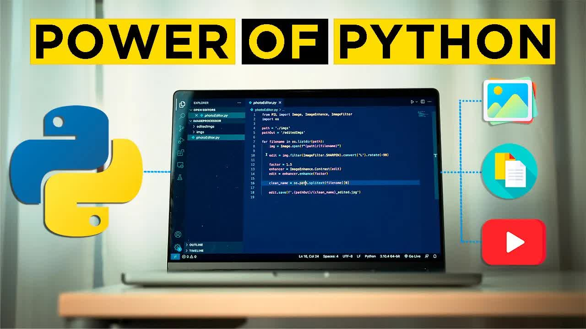

# 3-PYTHON-AUTOMATION-PROJECTS-FOR-BEGINNERS

<picture></picture>

 

---

## Video Information

| Property | Value |
|----------|-------|
| **Video Name** | `3-PYTHON-AUTOMATION-PROJECTS-FOR-BEGINNERS` |
| **Original Link** | [YouTube Video](https://m.youtube.com/watch?v=vEQ8CXFWLZU&pp=ugUEEgJlbg%3D%3D) |
| **Total Size** | **2 parts** - **49.83 MB** |
| **Quality** | **720** |
| **Status** | **Complete (100%)** |
| **Password Protected** | **NO** |

---

## Download Links

> ⬇️ Download **all parts**, then open `3-PYTHON-AUTOMATION-PROJECTS-FOR-BEGINNERS.zip`

| # | File | Link |
|---|------|------|
| 1 | `3-PYTHON-AUTOMATION-PROJECTS-FOR-BEGINNERS.z01` | [Download](https://raw.githubusercontent.com/arshiaghobadi1/Ourtube/main/videos/3-PYTHON-AUTOMATION-PROJECTS-FOR-BEGINNERS/3-PYTHON-AUTOMATION-PROJECTS-FOR-BEGINNERS.z01) |
| 2 | `3-PYTHON-AUTOMATION-PROJECTS-FOR-BEGINNERS.zip` | [Download](https://raw.githubusercontent.com/arshiaghobadi1/Ourtube/main/videos/3-PYTHON-AUTOMATION-PROJECTS-FOR-BEGINNERS/3-PYTHON-AUTOMATION-PROJECTS-FOR-BEGINNERS.zip) |

---

*Created by [avasam.ir](https://avasam.ir)*
